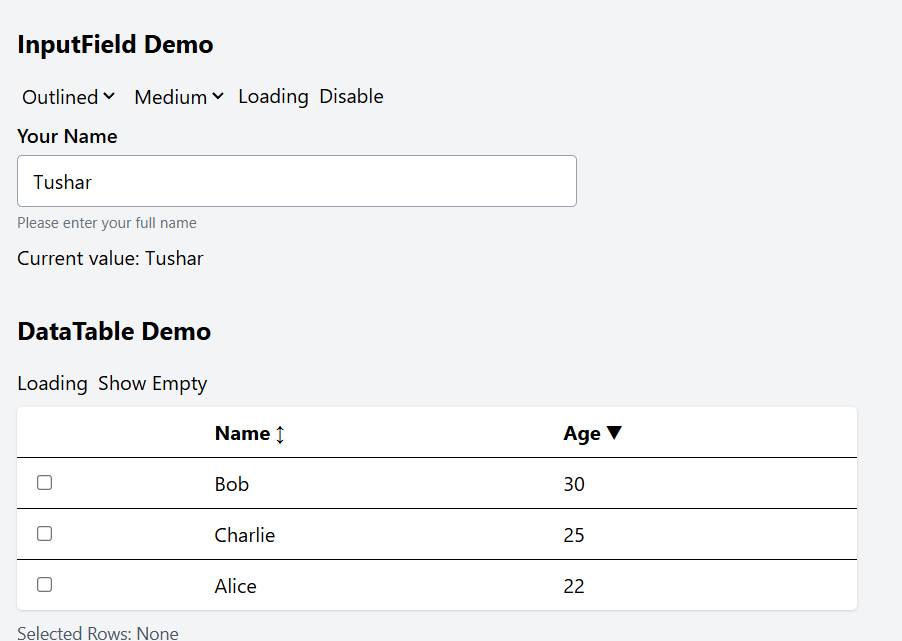

# React InputField & DataTable Components Demo

## Overview

This project demonstrates two reusable React components:

- **InputField**: A flexible input component with validation, variants, sizes, loading, clear button, and password toggle.
- **DataTable**: A basic data table with sorting, row selection, loading, and empty state.

A simple demo page (`App.tsx`) and Storybook stories showcase their usage and features.

---

## Folder Structure

```
Task/
├── src/
│   ├── components/
│   │   ├── InputField.tsx
│   │   └── DataTable.tsx
│   └── App.tsx
├── .storybook/
│   ├── main.js
│   ├── preview.js
│   └── ...
├── stories/
│   ├── InputField.stories.tsx
│   └── DataTable.stories.tsx
├── README.md
├── package.json
└── ...
```

---
## 🖼️ Screenshots




## Setup Instructions

1. **Clone the repository:**
   ```
   git clone <your-repo-url>
   cd Task
   ```

2. **Install dependencies:**
   ```
   npm install
   ```

3. **Run the demo:**
   ```
   npm start
   ```
   or
   ```
   npm run dev
   ```

4. **Run Storybook:**
   ```
   npm run storybook
   ```
   or
   ```
   npx storybook dev -p 6006
   ```

---

## Usage Example

See `src/App.tsx` for a live demo of both components.

See `stories/InputField.stories.tsx` and `stories/DataTable.stories.tsx` for Storybook usage and interactive documentation.

---

## Component Documentation

### InputField Props

| Prop             | Type                                      | Description                                 |
|------------------|-------------------------------------------|---------------------------------------------|
| value            | string                                    | Input value                                 |
| onChange         | (e: React.ChangeEvent<HTMLInputElement>)  | Change handler                              |
| label            | string                                    | Field label                                 |
| placeholder      | string                                    | Placeholder text                            |
| helperText       | string                                    | Helper text below input                     |
| errorMessage     | string                                    | Error message when invalid                  |
| disabled         | boolean                                   | Disable input                               |
| invalid          | boolean                                   | Show error state                            |
| loading          | boolean                                   | Show loading spinner                        |
| variant          | 'filled' \| 'outlined' \| 'ghost'         | Visual style                                |
| size             | 'sm' \| 'md' \| 'lg'                      | Input size                                  |
| clearable        | boolean                                   | Show clear button                           |
| showPasswordToggle | boolean                                 | Show password toggle for password fields    |

---

### DataTable Props

| Prop         | Type                       | Description                                 |
|--------------|----------------------------|---------------------------------------------|
| data         | T[]                        | Array of data objects                       |
| columns      | Column<T>[]                | Array of column definitions                 |
| loading      | boolean                    | Show loading spinner                        |
| selectable   | boolean                    | Enable row selection                        |
| onRowSelect  | (selectedRows: T[]) => void| Callback for selected rows                  |

---

## Approach

- **InputField**: Built for flexibility and accessibility, supports all required states and features.
- **DataTable**: Simple, generic, supports sorting, selection, loading, and empty state.
- **Demo**: `App.tsx` provides interactive controls to showcase all features.
- **Storybook**: Used for component documentation and isolated development.

---

## License

MIT